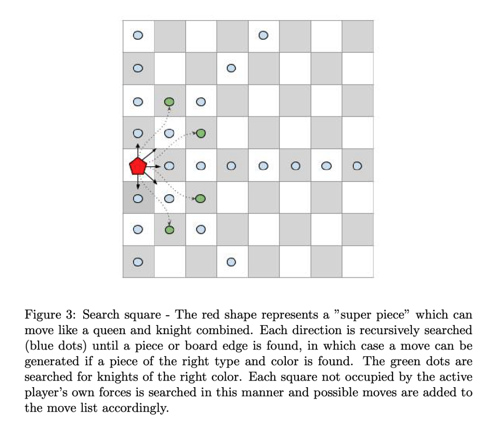

# Final Project for the Program Design and Data Structures course at Uppsala University

Welcome to the Check Norris chess engine! This lovely chess AI uses a simple evaluation function and the minimax algorithm to count the material on the board and make the best possible chess move. It is not the greatest chess engine ever built, but it might be the most entertaining (don't be surprised if it dances around your king when mate-in-one is readily available). However, if you are only a beginner chess player, it will kick your a**!
